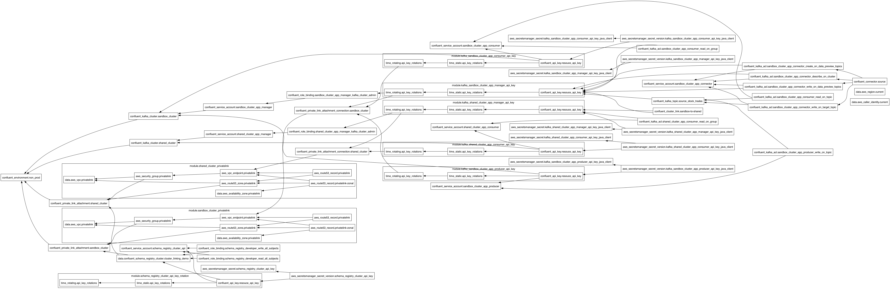

# Confluent Cloud Infrastructure as Code (IaC) Cluster Linking with PrivateLink Demo
This repository contains Terraform code to set up Confluent Cloud infrastructure with a focus on Cluster Linking using PrivateLink for secure connectivity.

Below is the Terraform visualization of the infrastructure that's created:

**Table of Contents**
<!-- toc -->
+ [**1.0 Resources**](#10-resources)
+ [**2.0 Running Terraform with PrivateLink**](#20-running-terraform-with-privatelink)
<!-- tocstop -->

## **1.0 Resources**
- [AWS PrivateLink Overview in Confluent Cloud](https://docs.confluent.io/cloud/current/networking/aws-privatelink-overview.html#aws-privatelink-overview-in-ccloud)
- [Use AWS PrivateLink for Serverless Products on Confluent Cloud](https://docs.confluent.io/cloud/current/networking/aws-platt.html#use-aws-privatelink-for-serverless-products-on-ccloud)
- [GitHub Sample Project for Confluent Terraform Provider PrivateLink Attachment](https://github.com/confluentinc/terraform-provider-confluent/tree/master/examples/configurations/enterprise-privatelinkattachment-aws-kafka-acls)
- [Geo-replication with Cluster Linking on Confluent Cloud](https://docs.confluent.io/cloud/current/multi-cloud/cluster-linking/index.html#geo-replication-with-cluster-linking-on-ccloud)

## **2.0 Running Terraform with PrivateLink**
When using AWS PrivateLink with Confluent Cloud, the Kafka bootstrap servers and REST endpoints are changed to use private DNS names (e.g., `lkc-xxxxx.us-east-1.aws.private.confluent.cloud`) that are only resolvable within the VPC where the PrivateLink endpoint is configured.

Since Terraform runs locally on your machine, it cannot resolve these private DNS names, leading to DNS lookup failures when creating topics, ACLs, and cluster links.

To resolve this, you must run the Terraform commands from an EC2 instance launched within the VPC that has the PrivateLink endpoint.

### Steps to Run from EC2:
1. Launch an EC2 instance in the sandbox VPC (`vpc-0e6e93895464c6f06`) in one of the specified subnets (e.g., `subnet-067930f9d2e89235d`).
2. Ensure the EC2 has internet access (e.g., via an Internet Gateway or NAT Gateway in the VPC).
3. Install Terraform on the EC2 instance.
4. Clone this repository on the EC2 instance.
5. Run the `./deploy.sh` script from the EC2 instance with the same parameters as you would locally.

This allows the EC2 instance to resolve the private DNS names and successfully execute the Terraform apply.

Note: The cluster link configuration has been modified to use public endpoints for compatibility, as the link creation may require public access.

